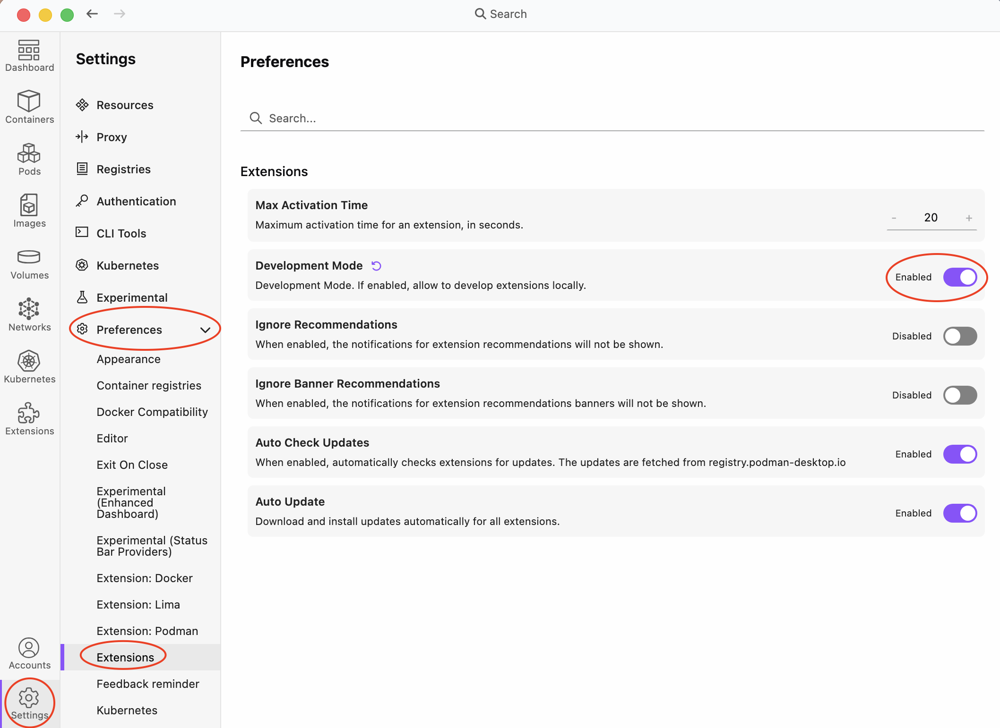
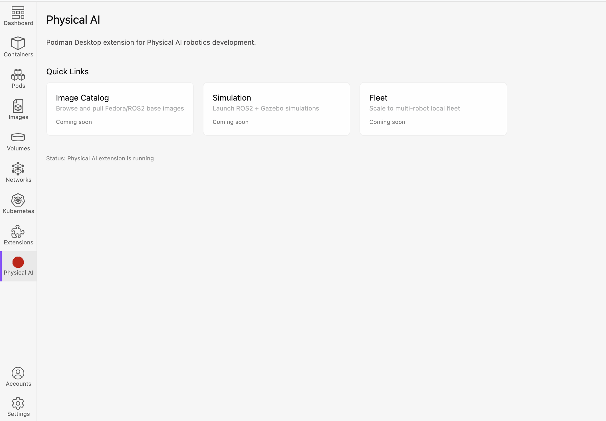

= Podman Desktop Extension for Physical AI Robotics Development
:toc: macro
:toc-title: Contents
:toclevels: 3
:icons: font
:source-highlighter: highlight.js

toc::[]

== Overview

A Podman Desktop extension that gives robotics developers a GUI-driven path from local development to OpenShift deployment.

*Target audience:* Robotics engineers unfamiliar with containers, CLI, or enterprise Linux.

*MVP target:* ROSCon Toronto demo, September 2026.

=== What It Does

* Curated catalog of Fedora/ROS2 base images pullable from Quay
* One-click launch of ROS2 + Gazebo simulation in Podman pods
* Browser-based simulation visualization (noVNC / web streaming)
* ROS2 topic inspection panel
* Multi-robot local fleet scaling with Zenoh middleware _(stretch)_
* Export to Kubernetes manifests and deploy to OpenShift _(stretch)_

=== Strategic Drivers

* Push workloads to OpenShift and the Red Hat ecosystem
* Clear path from Ubuntu builds on laptops to Fedora (and eventually RHEL) containers
* Bridge the gap from robotics lab projects to hardened, full-scale production deployment on OpenShift

== Quick Start

=== Prerequisites

* https://podman-desktop.io/[Podman Desktop] >= 1.28.0
* Node.js >= 20.0.0
* npm >= 10.0.0

=== Build

[source,bash]
----
cd physical-ai
npm install
npm run build
----

=== Load in Podman Desktop

. Enable **Development Mode**: *Settings > Preferences > Extensions > Development Mode*
+

. Navigate to *Extensions* in the left nav
. Go to the *Local extension* tab
. Click "Add a local folder..." and select `packages/backend`
. The "Physical AI" extension appears in the navbar
+

== Project Structure

[source]
----
physical-ai/                        <1>
├── packages/
│   ├── backend/                    <2>
│   │   ├── src/
│   │   │   ├── extension.ts        # Entry point (activate/deactivate)
│   │   │   └── api-impl.ts         # PhysicalAiApi implementation
│   │   ├── package.json            # Extension manifest
│   │   └── vite.config.js
│   ├── frontend/                   <3>
│   │   ├── src/
│   │   │   ├── App.svelte          # Root component with routing
│   │   │   ├── Dashboard.svelte    # Landing page
│   │   │   └── api/client.ts       # RPC client setup
│   │   └── vite.config.js
│   └── shared/                     <4>
│       └── src/
│           ├── PhysicalAiApi.ts    # API interface
│           └── messages/
│               └── MessageProxy.ts # RPC bridge
├── Containerfile                   <5>
├── docs/                           <6>
│   ├── podman-extension-plan.md    # Plan and work breakdown
│   ├── design.adoc                 # Architecture and design
│   └── stories/                    # Per-story status tracking
└── .internal/                      <7>
    └── reqs/                       # Jira exports (git-ignored)
----
<1> Root monorepo with npm workspaces
<2> Backend: extension lifecycle, Podman Desktop API integration
<3> Frontend: Svelte 5 + TailwindCSS UI
<4> Shared: RPC bridge and API interface between frontend and backend
<5> OCI image build for extension packaging
<6> Project docs: plan, design, progress tracking
<7> Internal files (git-ignored, not in public repo)

== Tech Stack

[cols="1,2"]
|===
| Component | Technology

| Extension framework | Podman Desktop Extension API
| Language | TypeScript
| Frontend | Svelte 5, TailwindCSS, `@podman-desktop/ui-svelte`
| Build | Vite 8, npm workspaces
| Testing | Vitest 4
| Routing | tinro (hash mode)
| Container images | Fedora + ROS2 Jazzy
| Registry | Quay.io
| Middleware | Zenoh / DDS
| Simulation | Gazebo
|===

== Documentation

* link:docs/podman-extension-plan.md[Plan doc] — work breakdown, progress, dependency analysis
* link:docs/design.adoc[Design doc] — architecture, component design, data flow
* link:docs/stories/[Story docs] — per-story status tracking

== Jira

[cols="1,1,2"]
|===
| Type | Key | Summary

| Epic | APPENG-5763 | Podman Desktop Extension for Physical AI Robotics Development
| Story | APPENG-5764 | Extension scaffolding and base image catalog
| Story | APPENG-5765 | Single robot simulation workflow
| Story | APPENG-5766 | Multi-robot local scaling _(stretch)_
| Story | APPENG-5767 | OpenShift deployment bridge _(stretch)_
|===

== License

Apache-2.0. See link:physical-ai/LICENSE[LICENSE].
