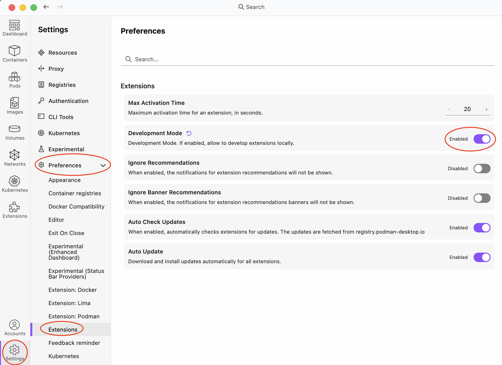
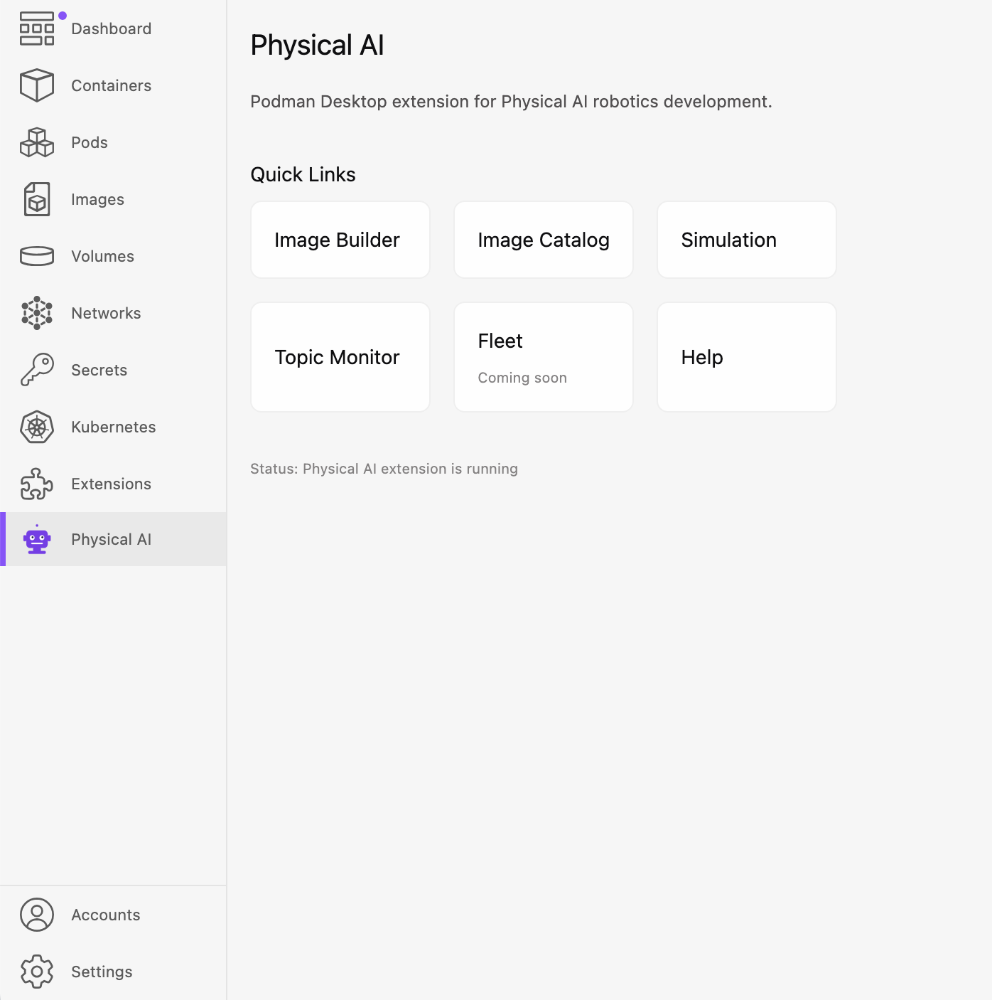

= Podman Desktop Extension for Physical AI Robotics Development
:toc: macro
:toc-title: Contents
:toclevels: 3
:icons: font
:source-highlighter: highlight.js

toc::[]

== Overview

A Podman Desktop extension that gives robotics developers a GUI-driven path from local development to OpenShift deployment.

*Target audience:* Robotics engineers unfamiliar with containers, CLI, or enterprise Linux.

*MVP target:* ROSCon Toronto demo, September 2026.

=== What It Does

* Browse and pull ROS2 base images from Quay.io (All or Curated catalog view)
* Image Builder with two-phase build (base + simulation), Quick Start presets, and an alternate Layers layout for composing custom images (including Hummingbird hardened-app layers)
* One-click launch of ROS2 + Gazebo simulation in a single Podman container — locally, or deployed to an OpenShift cluster
* Simulation viewer embedded inline in the extension panel (Show Viewer) or via browser-based noVNC — no separate VNC client needed
* Add TurtleBot3 robots into a running simulation interactively, with per-robot diagnostics (TF tree, costmap, laser topic checks)
* ROS2 topic inspection panel (Topic Monitor — list, drill-down, message peek)

=== Strategic Drivers

* Push workloads to OpenShift and the Red Hat ecosystem
* Clear path from Ubuntu builds on laptops to Fedora containers (currently parked)
* Bridge the gap from robotics lab projects to hardened, full-scale production deployment on OpenShift

== Quick Start

=== Prerequisites

* https://podman-desktop.io/[Podman Desktop] >= 1.28.0 (tested with 1.28.x and 1.29.x)
* Podman >= 5.x (tested with 5.8.5 and 6.0.2)
* Node.js >= 24.0.0, npm >= 11.0.0 (matches Podman Desktop's own Node requirement)

==== Podman Machine Requirements

[cols="1,1,1,2"]
|===
| Resource | Minimum | Recommended | Notes

| CPUs | 4 | 6+ | Gazebo + noVNC; arm64 Mac uses virtio-gpu by default (llvmpipe fallback if passthrough disabled)
| Memory | 4 GB | 8 GB | Single sim container uses ~2.5–3 GB. Default ~5.7 GB works for 1–2 robots. Increase for 3+ robots.
| Disk | 30 GB | 50+ GB | Base image ~1.5 GB, sim image ~3 GB, plus build cache layers
|===

To adjust: `podman machine set --memory 8192 --cpus 6` or use *Settings → Resources → Podman Machine* in Podman Desktop.

NOTE: On Mac Apple Silicon, Podman Machine uses LibKrun with virtio-gpu (API translation to Metal). Simulation launch passes `/dev/dri` by default on arm64 and uses hardware rendering when available; disable **Simulation GPU passthrough** in Preferences to force `llvmpipe`. Lidar and IMU topics (`/scan`, `/imu`) are available after spawn on a current sim image.

=== Build

[source,bash]
----
cd physical-ai
npm install
npm run build
----

=== Load in Podman Desktop

. Enable **Development Mode**: *Settings > Preferences > Extensions > Development Mode*
+

. Navigate to *Extensions* in the left nav
. Go to the *Local extension* tab
. Click "Add a local folder..." and select `packages/backend`
. The "Physical AI" extension appears in the navbar
+

== Project Structure

[source]
----
podman-work/                            <1>
├── README.adoc                         # This file — project landing page
├── docs/                               <2>
│   ├── podman-extension-plan.md        # Plan, work breakdown, progress
│   ├── design.adoc                     # Architecture and design
│   └── stories/                        # Per-story status tracking
├── physical-ai/                        <3>
│   ├── README.md                       # Developer README (build/contribute)
│   ├── Containerfile                   # OCI image build for extension packaging
│   └── packages/
│       ├── backend/                    <4>
│       │   ├── README.md               # User-facing README (ships in OCI image)
│       │   ├── src/                    # Extension entry point + PhysicalAiApi implementation
│       │   └── assets/                 # Bundled Containerfiles + entrypoints (ros2-jazzy-base,
│       │                               # ros2-jazzy-sim, ros2-humble-* — Humble unverified)
│       ├── frontend/                   <5>
│       │   └── src/                    # Svelte 5 pages/components — Dashboard, Image Catalog,
│       │                               # Image Builder, Simulation (Local/OpenShift), Diagnostics,
│       │                               # Topic Monitor, Help
│       ├── shared/                     <6>
│       │   └── src/                    # API interface (PhysicalAiApi), RPC bridge, shared types
│       └── cli/                        <7>
│           └── src/                    # Standalone CLI for build/launch/spawn without Podman Desktop
----
<1> Main repo (git root)
<2> Project docs: plan, design, per-story tracking (lives here, not inside extension dir)
<3> Extension source (monorepo with npm workspaces)
<4> Backend: extension lifecycle, Podman Desktop API integration, bundled container assets
<5> Frontend: Svelte 5 + TailwindCSS UI
<6> Shared: RPC bridge, API interface, simulation profiles and types
<7> CLI: build/launch/spawn workflows without Podman Desktop

== Tech Stack

[cols="1,2"]
|===
| Component | Technology

| Extension framework | Podman Desktop Extension API
| Language | TypeScript
| Frontend | Svelte 5, TailwindCSS, `@podman-desktop/ui-svelte`
| Build | Vite 8, npm workspaces
| Testing | Vitest 4
| Routing | tinro (hash mode)
| Container images | Ubuntu 24.04 + ROS2 Jazzy (Humble exists, not currently verified working)
| Registry | Quay.io
| Middleware | Zenoh / DDS
| Simulation | Gazebo
|===

== Documentation

* link:docs/podman-extension-plan.md[Plan doc] — work breakdown, progress, dependency analysis
* link:docs/design.adoc[Design doc] — architecture, component design, data flow
* link:docs/stories/[Story docs] — per-story status tracking

== License

Apache-2.0. See link:physical-ai/LICENSE[LICENSE].
