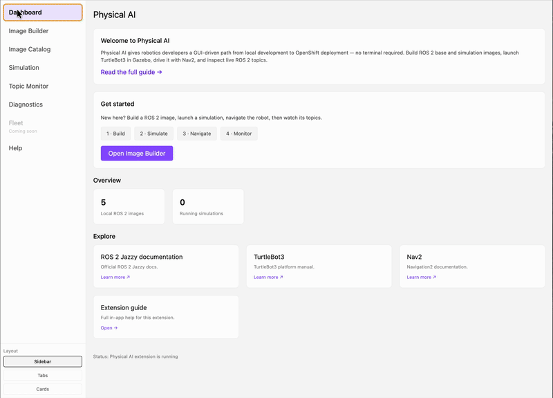
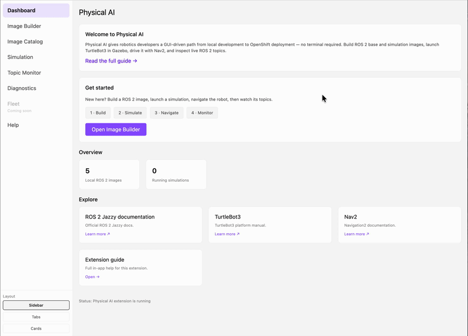
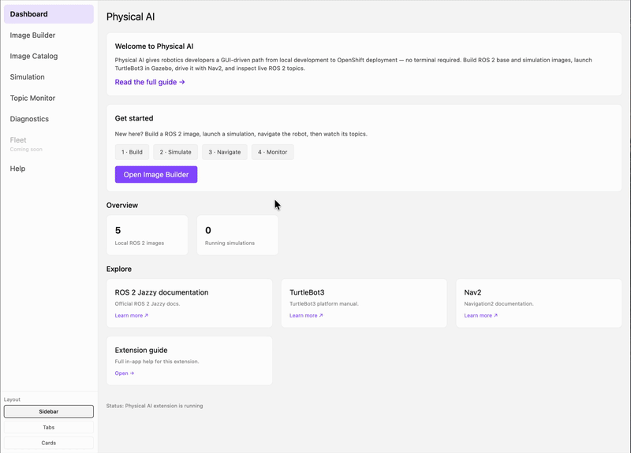

# Physical AI — Podman Desktop Extension

A Podman Desktop extension that gives robotics developers a GUI-driven path from local development to container deployment — no CLI required.

## Features

- **Image Catalog** — Browse and pull ROS2 images from Quay.io (All or Curated view)
- **Image Builder** — Two-phase build (base + simulation) with Quick Start presets (**Local** host-native and **OpenShift** amd64). Phase 1 builds the ROS2 base, Phase 2 layers Gazebo + noVNC on top (Nav2 packages included; **Navigate** on Jazzy launches Nav2). A **Layers** layout is also available to compose a custom image from Base OS / hardened app / ROS / simulation layers, including Hummingbird hardened-app images as optional layers.
- **Simulation** — One-click launch of Gazebo in a Podman container, embedded inline viewer or browser-based noVNC, interactive TurtleBot3 spawning
- **OpenShift Deployment** — Deploy a pushed `amd64` image to an OpenShift cluster: pick a namespace/context, preview manifests, Deploy, Open URL or embedded inline viewer, per-robot spawn/navigate/remove, GPU toggle, optional Hummingbird nginx sidecar demo
- **Diagnostics** — Live diagnostics for spawned robots, local or OpenShift
- **Topic Monitor** — Live view of active ROS2 topics, message types, and publisher/subscriber counts inside running simulation containers
- **Help** — In-extension documentation

Current container bases are **Ubuntu 24.04** (ROS2 Jazzy; Humble exists but is not currently verified working). Fedora/RHEL migration is planned.

## Prerequisites

| Requirement | Minimum | Recommended |
|-------------|---------|-------------|
| Podman Desktop | 1.28+ | 1.29+ (tested with 1.28.x, 1.29.x) |
| Podman | 5.x or 6.x | 6.0+ (tested with 5.8.5, 6.0.2) |
| Machine CPUs | 4 | 6+ |
| Machine Memory | 4 GB | 8 GB |
| Machine Disk | 30 GB | 50+ GB |
| Node.js (for building) | 24.0.0 | 24.x (matches Podman Desktop) |

Simulation on **Apple Silicon** uses virtio-gpu by default (`/dev/dri` passthrough). Disable **Simulation GPU passthrough** in Preferences to force software rendering. On amd64, software rendering is always used. Default Podman Machine (~5.7 GB) is fine for 1–2 robots. For 3+ robots, increase to 8 GB: `podman machine set --memory 8192`.

See [`packages/backend/README.md`](packages/backend/README.md) for platform-specific notes (Mac Apple Silicon, Linux).

## Install

**Option A — install the published image (no build required):** Podman Desktop → Extensions → **Install custom extension…** → paste:

```
quay.io/sgahlot/physical-ai-extension:latest
```

The image is a multi-arch manifest (`linux/amd64` + `linux/arm64`), so this works on both Apple Silicon and Linux without a local build.

**Option B — build from source:**

```bash
npm install
npm run build
```

Then load `packages/backend` in Podman Desktop (Settings → Extensions → Local extension).

## Quick Start



1. Open **Physical AI** (or **F1** → **Physical AI: Open Dashboard**)
2. **Image Builder** → Quick Start **Local** (**TurtleBot3 Sim (Jazzy)**) → Phase 1 Build → Phase 2 Build
3. **Simulation** → Launch → **Show Viewer** (embeds the Gazebo/noVNC canvas inline — no browser tab needed; or **Open in Browser** for a separate tab) → Add TurtleBot3 → optional **Navigate** (X/Y) and Topic Monitor **Peek**
4. **Stop & remove** when done — if you used **Open in Browser**, close the Gazebo (noVNC) tab manually



Or pull a pre-built image instead of building: **Image Catalog** → browse your Quay.io namespace → Pull.

To run on an OpenShift cluster instead, use Quick Start **OpenShift** (**TurtleBot3 Sim (Jazzy · amd64)**) — it targets `amd64` (tagged `-amd64`) so the image is cluster-pullable. On an Apple Silicon host this cross-builds via emulation and is slower (expected). Then push the image and open the **Simulation** page's **OpenShift** tab (Deploy → Preview manifests → Deploy → **Show Viewer** or Open URL; also lists deployed sims with delete/refresh and per-robot spawn/navigate/remove). The same embedded viewer as local Simulation works here too, rendering inline over the cluster's HTTPS route — validated live, including robot spawn/navigate working alongside it. In-cluster (no GPU) the sim renders via off-screen software EGL; the Deployment requests **8 guaranteed CPUs by default** so navigation runs smoothly at ~real-time (fewer cores sag the real-time factor — at 2 cores **Navigate** never completes, at 4 it completes but is slow and jerky). The count is adjustable via the **Software-render CPUs** field — dial it to your node sizes, since an N-CPU Guaranteed pod only schedules on a node with ≥ N allocatable CPU. A **"Cluster has a GPU"** toggle switches to hardware EGL rendering (validated live on a real GPU cluster for a single robot, including the GUI via VirtualGL) and drops back to 2 CPUs (see [`packages/backend/README.md`](packages/backend/README.md) → GPU and rendering).



Idle noVNC tabs may show Disconnected; reconnect or refresh — the simulation is still running. On arm64 with GPU passthrough, lidar/IMU topics are available after spawn; **Navigate** on Jazzy sim uses Nav2 (`navigate_to_pose`) with obstacle-aware planning (Humble images still use open-loop `cmd_vel`).

## Troubleshooting

- **noVNC shows "Disconnected"** — the idle tab dropped its WebSocket; reconnect or refresh the page. The simulation is still running.
- **OpenShift Deploy fails** — confirm you're logged in to the target cluster (Podman Desktop's Kubernetes context) and that the image was pushed for `amd64` (use Quick Start **OpenShift**, not **Local**, unless your cluster nodes are arm64).
- **Podman Machine runs out of resources** — see Prerequisites above; bump CPUs/memory with `podman machine set --memory 8192 --cpus 6`.
- **Humble images don't build/run** — the Humble path is not currently verified working; use the Jazzy Quick Start instead.

## Project Structure

| Path | Purpose |
|------|---------|
| `packages/backend` | Extension entrypoint, RPC API, bundled container assets (Containerfiles, entrypoints, world files) |
| `packages/frontend` | Svelte 5 + TailwindCSS webview UI |
| `packages/shared` | API interface (RPC methods), RPC bridge, shared types (simulation profiles, config, container info) |
| `packages/cli` | Standalone CLI (`physical-ai`) for build/launch/spawn without Podman Desktop — see [`packages/cli/README.md`](packages/cli/README.md) |

## Tech Stack

TypeScript throughout. Backend runs in Podman Desktop's Node.js/Electron host. Frontend is a Svelte 5 SPA in a webview panel. Build tooling: Vite 8, npm workspaces. Routing: tinro (hash mode). Theming: `.pai-*` CSS classes using Podman Desktop's `--pd-*` CSS variables.

## Packaging

The root `Containerfile` builds an OCI image of the extension. The backend `README.md` and icon ship inside the image and are displayed by Podman Desktop.

## Settings

17 configuration properties under **Settings → Preferences → Physical AI**, grouped into 5 sections (General, Simulation, Image Catalog, Image Builder, OpenShift):

| Preference | Purpose |
|------------|---------|
| Default namespace | Quay.io namespace for catalog and image tags |
| Navigation layout | Cards or sidebar navigation shell |
| Topic peek timeout | Seconds for Topic Monitor Peek (1–30, default 5) |
| Image Builder wizard defaults | Robot, distro, middleware, engine, base preset (5 properties) |
| Simulation GPU passthrough | On arm64 Mac, pass `/dev/dri` and use virtio-gpu (default on). Disable to force llvmpipe |
| Simulation image allowlist | Optional tag/digest pins for Simulation launch (enforced) |
| Catalog view mode | `all` or `curated` |
| Catalog curated allowlist | Wildcard patterns for Curated view |
| Image Builder layout | Quick Start or Layers |
| Build history limit | Number of recent builds to remember |
| OpenShift default namespace | Default namespace/context for the OpenShift deploy tab |
| Default software-render CPUs | Guaranteed CPU count (1–64, default 8) seeding the Software-render CPUs field on the OpenShift tab |
| OpenShift deploy image allowlist | UI convenience filter for the OpenShift image picker (not enforced) |

### Simulation image trust

Launching a simulation runs `/entrypoint-gazebo.sh` from the **local** image you select. Name/tag allowlisting is not cryptographic verification — treat local images like any other container you run. Prefer builds from **Image Builder** or pulls from your Quay namespace. Optionally set **Simulation image allowlist** to exact tags or `@sha256:…` digests for locked-down demos.

## License

Apache-2.0
